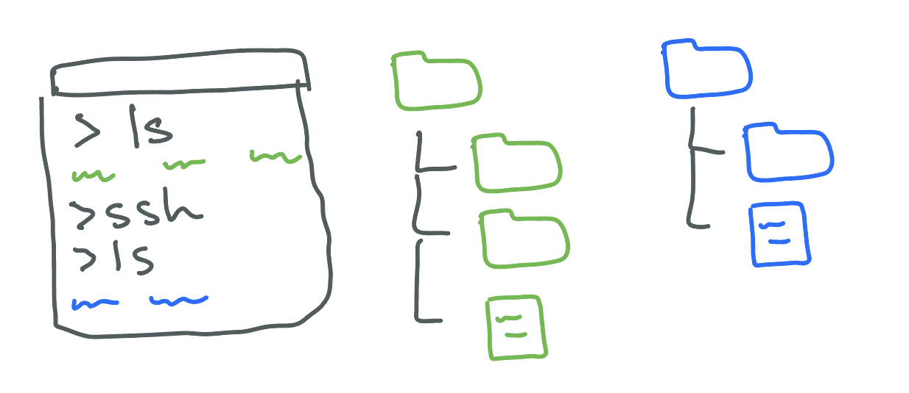

# UCSD CSE15L W24 Syllabus and Logistics

- [Joe Gibbs Politz](https://jpolitz.github.io) (Instructor)

[Basics](#basics) -
[Schedule](#schedule) -
[Staff &amp; Resources](#staff--resources) -
[Grading](#course-components-and-grading) -
[Policies](#policies)

In this course, we'll explore a number of **Software Tools & Techniques** that are used commonly by developers in their day-to-day work. You'll learn how to manage files and programs from the command line, and you'll get direct practice (and build muscle memory!) with keyboard shortcuts, tricks, and techniques for managing data and programs. Throughout, you'll exercise and improve your skills in program understanding and debugging.

This web page serves as the main source of announcements and resources for the course, as well as the syllabus.

## Basics

- Lecture: [Warren 2001](https://map.concept3d.com/?id=1005#!m/246292), 9-9:50am Mon/Wed
- Labs: Wednesdays and Thursdays (check your schedule)
- “Skill Demonstration” Exams: Flexible scheduling in weeks 3, 5, 7, and 9
- Final Exam (used for making up test credit): Flexible scheduling in finals week

- Podcasts: [podcast.ucsd.edu](https://podcast.ucsd.edu/watch/sp23/cse131cse231_a00)
- Q&A Forum: [EdStem](https://edstem.org/us/courses/51148/discussion/)
- Gradescope: [https://www.gradescope.com](https://www.gradescope.com)
- Textbook/readings: There's no official textbook, but we will link to
  different online resources for you to read to supplement lecture. There are a few good general overall resources if you want others to peruse, but these aren't required:
  - Free: [MIT Missing Semester](https://missing.csail.mit.edu/)
  - Not free but pretty cheap: [Julia Evans Zines](https://wizardzines.com/), especially [The Pocket Guide to Debugging](https://wizardzines.com/zines/debugging-guide/)

## Schedule

The schedule below outlines topics, due dates, and links to assignments. The
schedule of lecture topics might change slightly, but I post a general plan so
you can know roughly where we are headed.

### Week 1 - Markdown, URLs, and Paths

- [Lab 1 Activities](./week1/index.md)
- TODO:
  - Quiz 1 Due **Wednesday, January 10, 9am**
  - Lab Report 1 Due **Tuesday, January 16, 10pm**
- Reading and resources:

