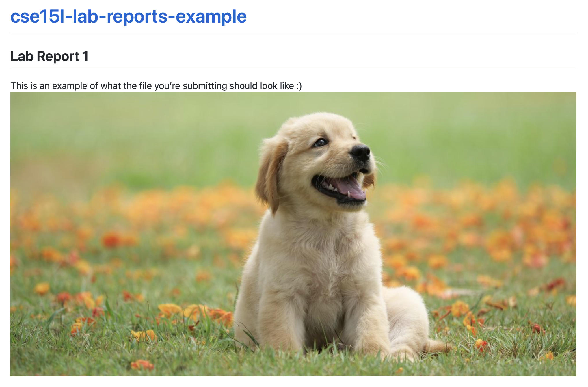

# Week 1 – Markdown, URLs and Paths

## Lecture Materials

- [Monday Lecture Handout (Slides)](https://docs.google.com/presentation/d/1ujXevnvG3fyxLY710RnWjDeMYYLt6fa_/edit?usp=sharing&ouid=109342588918218787603&rtpof=true&sd=true)
- [Monday Lecture Handout (PDF)](https://drive.google.com/file/d/1puBjiB0mx-k0YGsITeQH9IQb56lCfVsJ/view?usp=sharing)
- [Wednesday Lecture Handout (Slides)](https://docs.google.com/presentation/d/145pR7irxqa744Jyzm49w7i-GbfQ3MHlL/edit?usp=sharing&ouid=107408851252378993524&rtpof=true&sd=true)
- [Wednesday Lecture Handout (PDF)](https://drive.google.com/file/d/1Tr3KFyvsCaAoMj3rcSzmDPh8DQLJdisy/view?usp=share_link)
- Monday Notes <iframe src="https://drive.google.com/file/d/14y3BLI4nl43pHheZHbAVSn6VJbHs4V0T/preview" width="100%" height="600px"></iframe>
- Wednesday Notes <iframe src="https://drive.google.com/file/d/14wJ4DcawCTQr41s65mqUu4Dtq0LQ52QB/preview" width="100%" height="600px"></iframe>

## Related Links

- [About Git](https://docs.github.com/en/get-started/using-git/about-git)
- [Github](https://github.com/)
- [Github Pages](https://pages.github.com/)
- [Github Desktop](https://desktop.github.com/)
- [Markdown cheat sheet](https://commonmark.org/help/)
- [What is Markdown?](https://www.markdownguide.org/getting-started/)
- [Git](https://git-scm.com/) (You don't necessarily have to install this on its own for your computer; but this is the link to the underlying tool called `git`. It's included in Github Desktop.)

## Key Definitions

- **git repository**: A folder that tracks the history of edits to its files
- **Github repository**: A git repository online, like a Google Drive folder with history
- **Github pages**: A service that takes a Github repository and builds a
website from it (usually relying on conventions, like `index.md`)
- **Markdown**: A way to write plain text files with a little bit of formatting
- **commit**: A set of changes to a file or multiple files in a repository. A
repository history is made up of commits
- **git clone**: A git action to copy a repository from one place to another
(usually from somewhere like Github to our computer). Copies the contents of the
folder _and_ the entire history – the whole repository.
- **git commit**: A git action to take some changes we've made to files and
turn them into a commit in the repository's history
- **git push**: A git action to send commits from one place to another (usually
from our computer to Github)

## Lab Tasks

In this lab you'll make a professional website for yourself where you can post
your lab reports for the course. Please contact the instructor
(`jpolitz@ucsd.edu`) if for
personal privacy or security reasons you do not want to publish a public
website, even under a pseudonym.

### Part 1 – Meet Your Group!

We will split into groups of 6-8 students for discussion. For week 1, you may sit
wherever you want and choose who you want to work with. Starting week 2, we will have
assigned seating and groups. These
groups will be somewhat stable throughout the quarter, though some small changes
will likely happen. You will have a tutor or TA assigned to your group for help
and discussion.

Your discussion leader (the tutor/TA in your lab) will share a Google Doc with
your group where you can fill in notes as you work; this document is only for
your group. Your discussion leader will _not_ take notes for you. 

**Write down in notes**: In your groups, share, and note in the running notes
document (discussion leaders, you answer these as well!):

- How you'd like people to refer to you (pronounce your name/nickname, pronouns
like he/her/they, etc)
- Your major
- One of:
    - A UCSD student organization you're a member of or interested in
    - Your favorite place you've found on campus so far
    - A useful campus shortcut or trick you know
- Your answer to the following question. Discuss why you chose that answer. 

### Part 2 – Your First Workspace

In this part of the lab you'll set up a _Workspace_, which has a file system and
a terminal we can use to write code and run commands. We'll do this on Edstem,
but many systems you'll use in the future will have a similar notion of a
workspace.

1. Log into Edstem [https://edstem.org](https://edstem.org), and go to the
“Workspaces” area, and make a new Workspace (see image below). You can pick the
name, but something like “Lab1” is a good idea. 
2. Then, let's access the code from class. Open a terminal,
and run the following command:

    ```
    git clone https://github.com/ucsd-cse15l-f23/lecture1
    ```

    To run the command, you can copy it directly from here, paste it into your
    terminal, and press Enter.
3. **Write down in notes/discuss**: What happened? Write down everything you
noticed happen when you ran that command, and discuss what you saw as a group.

Next, let's make sure we can run the `javac` and `java` commands we saw in
class. This will involve running them _from the correct working directory_.
The `git clone` command made a folder called `lecture1`; we'll use the terminal
to _change directory_ into that folder and then run commands there:

1. Run `pwd`, this should show a result like `/home`; you should see this:

    ```
    [user@sahara ~]$ pwd
    /home
    ```
1. Then run `cd lecture1`. That command produces no output when it works! Try
using `pwd` again to see what changed. You should see this:

    ```
    [user@sahara ~]$ cd lecture1
    [user@sahara ~/lecture1]$ pwd
    /home/lecture1
    ```

    We see that we changed directories in two ways. First, the _prompt_ changed
    – it now says `[user@sahara ~/lecture1]$` which is a reminder about which
    directory the terminal is in. Also, the output of `pwd` shows
    `/home/lecture1`, which is the new working directory.

    `pwd` is a useful tool for checking “where your terminal is”. There are
    several commands that are good for this kind of status checking, `pwd` is
    the first we'll learn.
2. Now run `ls`; you should see something like this:

    ```
    [user@sahara ~/lecture1]$ ls
    Hello.java  messages  README
    ```

    `ls` shows the names of the files and folders inside the current working
    directory. It's another useful status-checking command.
3. Finally, let's get to running the `java` commands. First, run `javac`:

    ```
    javac Hello.java
    ```
4. **Write down in notes/discuss**: What happened? Write down everything you
noticed happen when you ran that command, and discuss what you saw as a group.
(Hint: did any new files related to Hello.java get created? Can you see them
with `ls` or in the file browser in the workspace?)
5. Next, run this command (feel free to pick any of the three languages!)

    ```
    java Hello messages/es-mx.txt
    ```
6. **Write down in notes/discuss**: What happened? What output do you see? How
does the output relate to the code in the `Hello.java` file?
7. Add a new language file to `messages` (you can pick a language and use the
official code by looking at
[https://www.andiamo.co.uk/resources/iso-language-codes/](https://www.andiamo.co.uk/resources/iso-language-codes/)).
It should be called `<language-code>.txt` in the `messages` directory, and have
“Hello World!” translated into the language you chose.
If someone in your group knows the language, they can write it directly, or you could use Google
Translate or other similar tools!

**Write down in notes**: Take a screenshot of running `java` on your newly-added
language file and include it in your notes.


<!--
Ideas: add a new language to messages/, compile + run the Hello program, 

Make a directory for data

Use ls to show the contents of all these directories

Use tree to show structure from command line

“With your working directory set to /home, `ls` the contents of messages”

“With your working directory set to /home/lecture1, `ls` the contents of messages”

mkdir/mkdir -p

find/grep

Try running the commands `cd`, `ls`, `pwd`, `mkdir`, and `cp` a few times in
different ways.  Discuss in your group what you see. Can you cause them to
produce error messages? What do they mean? If you're on Windows, what happens
when you use them on Windows?

Here are some specific useful commands to try:

- `cd ~`
- `cd`
- `ls -lat`
- `ls -a`
- `ls <directory>` where `<directory>` is
`/home/linux/ieng6/cs15lsp23/cs15lsp23abc`, where the `abc` is one of the other
group members' username
- `cp /home/linux/ieng6/cs15lsp23/public/hello.txt ~/`
- `cat /home/linux/ieng6/cs15lsp23/public/hello.txt`

**Write down in notes**: Copy at least one example from each group member, with
an explanation, into your shared notes doc.

Hint: To log out of the remote server in your terminal, you can use:

- Ctrl-D
- Run the command `exit`

You can also open more terminals in VSCode (there is a little + button at the
top of the terminal window where you can create another).
-->

### Part 3 – git, Github, and Github Pages

Having a professional portfolio website for yourself can be useful in many, many
ways. It's a useful URL to put at the top of your resume/CV where potential
employers can learn more about you.  Lots of great work in CS is published only on
someone's personal page, or is at least most accessible there.  Most CS faculty
have such a page ([just](https://roseyu.com/) [a
few](https://cseweb.ucsd.edu/~tzli/) [examples](http://kvaccaro.com/) [from
new](https://web.engr.oregonstate.edu/~jensenca/OSU_ENGR/index.html) CSE
faculty), for example.

Also, journaling and logging what you've learned is a powerful tool. Writing
down what we've done and how we've done it, for an audience (real or imagined)
other than ourselves, forces us to confront lingering misconceptions and cements
what we learned in our memories. It's also simply useful to refresh your memory
later!

For these reasons, we'll spend the rest of this lab creating a personal page,
and then learning to write a blog post about what we learned.

Github ([https://www.github.com](github.com)) is a web service for storing and
sharing code, along with a huge number of services surrounding that code. It
uses a tool and protocol called `git` [https://git-scm.com/](https://git-scm.com) to store and
retrieve that code. Github Pages
[https://pages.github.com/](https://pages.github.com/) is one of the services
Github provides for publishing personal and project websites from your Github
account.

This lab is a basic introduction to all of these. We will learn to use them in
more detail as the quarter goes on; learning all that git, Github, or Github
Pages has to offer could take months of practice!

### Part 4 – Creating a Website with Github Pages

This section will show you how to create a site with Github Pages that you'll
use for your lab reports.

There are written instructions with screenshots below you can follow, and also a
video:

<iframe width="560" height="315" src="https://www.youtube.com/embed/GZqizez1Dzs" title="GitHub Pages Youtube Video" frameborder="0" allow="accelerometer; autoplay; clipboard-write; encrypted-media; gyroscope; picture-in-picture; web-share" allowfullscreen></iframe>

#### Make a Github Account

Go to [https://www.github.com](https://www.github.com) and create an account:


(If you already have an account, you choose if you want to use it or create a
new one for this course).

You can choose any username you like for the account; it doesn't have to be
related to your legal or preferred name, though it can be and often is. Some
people choose names related to their name, like me (my Github account is
[jpolitz](https://github.com/jpolitz)). Others choose more abstract or whimsical
names for their accounts, just like usernames on any other service. Feel free to
do whatever feels right to you, and in any event, you can always [change it
later](https://docs.github.com/en/account-and-profile/setting-up-and-managing-your-github-user-account/managing-user-account-settings/changing-your-github-username).


#### Create a Repository

Once you've created your account, we are going to _create a new repository_ on
Github. A _repository_ is a folder or directory with an associated history of
changes that were made to the files within it. In this sense, a repository on
Github has some similarities to a folder in Google Drive; the differences are
mainly in the level of control we get in managing that history of changes.


Name the repository `cse15l-lab-reports` (in my screenshot it looks like the
name is taken because I made it before taking the screenshot; it will be green
and OK for you). Leave the other settings as they are, and click "Create
Repository" at the bottom.


You should see a screen like this (but with your username):


Click the "Create a new file" link (small, in blue, beneath the "Set up in
Desktop" button). Make a new file called `index.md`, and put some text in it
(whatever you like).


Scroll down to the bottom of the page and click "Commit new file". You should see
a view of your repository that now lists a file called `index.md`.

You have a public Github repository with some text in it! You can copy the link from your browser and send it to your friends and family to view!

#### Making a Pages Site

Next, click on "Settings" at the top of your repository, and then choose the
"Pages" option in the sidebar:


Choose `main` as the source for Github Pages, and click "Save".


At the top it'll say “GitHub Pages source saved". Wait a bit and refresh the
page. Eventually you'll see a message that says “Your site is live at `<url
here>`.” (This can take a few minutes!) Click the link that's shown there; at
first it will say the page isn't found. Wait a few minutes, then refresh the
page.  Then you should see the text you wrote show up on a page like this:


<!-- **Write down in notes** – everyone should be able to screenshot their page
showing the text they wrote in their `index.md`.

**Write down in notes** – Conduct the following experiment: -->

Note that in addition to seeing your file at, e.g,
[https://jpolitz.github.io/cse-15l-lab-report/](https://jpolitz.github.io/cse-15l-lab-report/),
you can also see it with `index.html` added to the end of the URL:
[https://jpolitz.github.io/cse-15l-lab-report/index.html](https://jpolitz.github.io/cse-15l-lab-report/index.html)
(Try it!).

**Do now!** Add another file to your repository with any name you choose, but
end it in the extension `.md`. Can you use this idea to see that file?

<!-- Write down what you think is happening when you commit a new file. -->

#### Editing Markdown

The `.md` extension stands for "Markdown," which is a particular text format
used for writing. There are many good documents on the web. A good cheat sheet
and explainer are here:

- [Cheat sheet](https://commonmark.org/help/)
- [What is Markdown?](https://www.markdownguide.org/getting-started/)

Skim both of those documents, then try to use some of the elements described in
the cheat sheet in your `index.md` file. How do some of the different formatting
options show up when you use them? Are any surprising?

<!-- **Write down in notes** – Try all of the formatting in the “Basic Syntax” part
of the markdown cheat sheet above; everyone should screenshot their page that
uses all of these. -->

You should now have:

- A repository with at least two files (`index.md` and another one you made up)
- In one of those files, a use of each kind of basic Markdown syntax
- A page that shows the rendered version of your Markdown text at a public URL

**Congratulations** – you now know how to make a (simple), public-facing website
with basic formatting! You can share the link to your page with anyone in the
world with an internet connection, and they can see your page.

(Fun fact: [the page you are
reading](https://github.com/ucsd-cse15l-s23/ucsd-cse15l-s23.github.io/blob/main/_posts/weeks/2023-01-09-week1.md)
is written in Markdown and uses Github Pages!)

#### Before you leave

Please go ahead and fill out this Google form before you leave, this will help us create the seating chart for next week. [Link to Google form](https://docs.google.com/forms/d/e/1FAIpQLSdNXzpZkNwti0jGI-DFD2g6IVvXRqYvX1sWcaJsDL1GIVZLyg/viewform?usp=sf_link)

## Lab Report 1 - Remote Access and FileSystem (Week 1)

You’ll submit a lab report by writing a blog post about the basic filesystem commands we learned today. You should create the post, like we 
just described using Github Pages. The lab report is due Tuesday, January 16 by 10pm. 
See the FAQ below for common questions, including how to add images and what to submit 
to Gradescope.

For **each** of the commands `cd`, `ls`, and `cat`, and using the workspace you created in this lab:

1. Share an example of using the command with *no* arguments.
2. Share an example of using the command with a path to a *directory* as an argument.
3. Share an example of using the command with a path to a *file* as an argument.

So that's 9 total examples (3 for each command). For each, include:

- A screenshot or Markdown [code block](https://www.markdownguide.org/extended-syntax/#fenced-code-blocks) showing the command and its output
- What the working directory was when the command was run
- A sentence or two explaining why you got that output (e.g. what was in the filesystem, what it meant to have no arguments).
- Indicate whether the output is an *error* or not, and if it's an error, explain why it's an error.

You will upload your submission by publishing the page on Github Pages, then
printing the page to PDF and uploading to the Lab Report 1 assignment on
Gradescope.

**Note:** Make sure to use backticks \` around keywords such as commands, file names, paths, etc. to make them show up as code like `cd`. 

### Submission FAQ

**Should I submit the Google Doc we used during the lab session for this Lab
Report Assignment?**

No, this individual lab report submission is about the screenshot tutorial
you'll put on your own Github Pages.

You need not upload the shared notes Google doc anywhere.

**How do I add images/screenshots to my lab report?**
    
In your repository, click the “add file” button and then click “upload files”. Upload 
the screenshots you want to include from your computer. Then, in the .md file you 
created for your lab report 1, you can add the images by using the ``
syntax as described in the markdown cheat sheet link from earlier. Replace `imageName.png`
with whatever your image is named in your repository.
For example, in the screenshot below, I have `dog.jpg` in my repository so I could include 
that screenshot by typing `` in my lab1.md file.

    
**How do I submit my Github Pages site to Gradescope?**

Visit your Github Pages website with your tutorial in a browser (Safari, Chrome, Brave, 
Firefox, Edge, etc), and use “Print” to save it to a PDF. Then, upload the PDF to the 
“Lab Report 1 - Remote Access and Filesystem” assignment on Gradescope. For example, 
if your Github Pages site has the link [https://pandrew99.github.io/cse15l-lab-reports-example](https://pandrew99.github.io/cse15l-lab-reports-example)
and you made your lab report 1 .md file called `lab1.md`, you would access it by adding `lab1.html` 
at the end, like: [https://pandrew99.github.io/cse15l-lab-reports-example/lab1.html](https://pandrew99.github.io/cse15l-lab-reports-example/lab1.html).
The format of the PDF you submit should look something like this:

    
**Can I use screenshots from the lab document we worked on together?**

Sure! If they are from your account, that's fine. Don't share another person's screenshots,
instead describe where you got stuck and include a screenshot of what doesn't
work.

