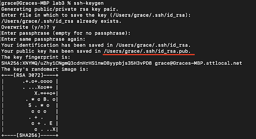

# Week 3 – VSCode and Your Local Machine

## Lecture Materials

- [Monday Lecture Handout (Slides)](https://docs.google.com/presentation/d/1281XbfK5_dVXcVU-XNkb9BObIz0gt0hC/edit?usp=sharing&ouid=109342588918218787603&rtpof=true&sd=true)
- [Monday Lecture Handout (PDF)](https://drive.google.com/file/d/1cTFm-d3cPLclZn0NxaD8Maqcapsx1Qwh/view?usp=sharing)
- [Wednesday Lecture Handout (Slides)](https://docs.google.com/presentation/d/127DMrEDOnEGvZ8OzIwbbsueraSTGuTrz/edit?usp=sharing&ouid=109342588918218787603&rtpof=true&sd=true)
- [Wednesday Lecture Handout (PDF)](https://drive.google.com/file/d/18qAdUK8P-Cis9itwRQt1ddbqbLjhvKuk/view?usp=sharing)
- Monday Notes <iframe src="https://drive.google.com/file/d/1fSI3BnfmhkGhgmtBXnkJ_T6QZJmPuSea/preview" width="100%" height="600px"></iframe>
- Wednesday Notes <iframe src="https://drive.google.com/file/d/1oqmo9Xo1JRYbJjXkDMRxo-rV84Curf-I/preview" width="100%" height="600px"></iframe>

### To Read/For Your Reference

- [Visual Studio Code](https://code.visualstudio.com/)
- Read these two articles by Julia Evans (one summarized in a comic below):
    - [When debugging, your attitude matters](https://jvns.ca/blog/debugging-attitude-matters/)
    - [How I Got Better at Debugging](https://jvns.ca/blog/2015/11/22/how-i-got-better-at-debugging/)
- Read this article by John Regehr: [How to Debug](https://blog.regehr.org/archives/199)
    - You don't need to know what all the technical tools are in these readings (systems programming, CSS, divs, etc)
- From the Regehr article, focus on the vocabulary (symptom, bug, etc); from the Evans articles, focus on the vibes
- This article: [https://drive.google.com/file/d/1zbMVZxsI1zOBPhSsvBi4kB5dPJuxyOJh/view?usp=sharing](https://drive.google.com/file/d/1zbMVZxsI1zOBPhSsvBi4kB5dPJuxyOJh/view?usp=sharing)
  (Note that assigning an article doesn't necessarily mean we all agree with everything in it...)

### Video Shorts

<iframe width="560" height="315" src="https://www.youtube-nocookie.com/embed/XJBUw3sNeuk" title="YouTube video player" frameborder="0" allow="accelerometer; autoplay; clipboard-write; encrypted-media; gyroscope; picture-in-picture; web-share" allowfullscreen></iframe>

<iframe width="560" height="315" src="https://www.youtube-nocookie.com/embed/hIqa1EoqIBM" title="YouTube video player" frameborder="0" allow="accelerometer; autoplay; clipboard-write; encrypted-media; gyroscope; picture-in-picture; web-share" allowfullscreen></iframe>

<iframe width="560" height="315" src="https://www.youtube-nocookie.com/embed/ZsCVRkR_nik" title="YouTube video player" frameborder="0" allow="accelerometer; autoplay; clipboard-write; encrypted-media; gyroscope; picture-in-picture; web-share" allowfullscreen></iframe>

<iframe width="560" height="315" src="https://www.youtube-nocookie.com/embed/M_S88_2t1UE?cc_load_policy=1" title="YouTube video player" frameborder="0" allow="accelerometer; autoplay; clipboard-write; encrypted-media; gyroscope; picture-in-picture; web-share" allowfullscreen></iframe>

## Lab Tasks

As usual, we publish these ahead of time, but they aren't guaranteed to be final
until the start of lab on Monday.

This week in lab, you will set up the terminal in an environment called Visual
Studio Code on your own computer (or on a lab computer in your course account),
and you'll complete the first Skill Demonstration.

### Part 1 – Visual Studio Code

(If you can't or don't want to use your own computer for this for any reason,
you can do the installation of VScode on one of the computers in the lab! You
can do all your work on the lab computers all quarter, no personal laptop setup
required.)

Go to the Visual Studio Code website
[https://code.visualstudio.com/](https://code.visualstudio.com/), and follow the
instructions to download and install it on your computer. There are versions for
all the major operating systems, like macOS (for Macs) and Windows (for PCs).

When it is installed, you should be able to open a window that looks like this
(it might have different colors, or a different menu bar, depending on your
system and settings):


**Write down in notes**: Everyone should share a screenshot of VScode open –
help folks figure it out if it won't install. If someone gets stuck, take a
screenshot of the error message or point at which they are stuck so we can help
them figure it out later, and they can decide to keep trying (potentially with
the tutor helping) or move on.

Then if you're on Windows: install `git` for Windows, which comes with some
useful tools we need:

[Git for Windows](https://gitforwindows.org/)

Once installed, use the steps in this post to set your default terminal to use
the newly-installed `git bash` in Visual Studio Code:

[Using Bash on Windows in VScode](https://stackoverflow.com/a/50527994)

(That's all the special instructions for Windows users). Then, to run commands,
open a terminal in VScode. (Ctrl or Command + \`, or use the Terminal → New
Terminal menu option). Try running some of the commands we learned in earlier
labs and lectures on this computer.

**Write down in notes**:

- What was the working directory of the terminal that opened in Visual Studio Code?
- What is your home directory on this computer?
- What files and folders are in the home directory?
- Where do you think files that download from your web browser go? Can you list
  them with `ls`? What's the absolute path to that folder?
- Do any commands work differently than you expect on this computer?
- Are you able to use `ssh` with your username and password
  from the terminal in VScode to log into `ieng6` and enter the course-specific account? Refer to [lab
  2](/week2/#remotely-connecting-to-cse15l-account) to recall the commands you used.

Take a few screenshots of what you tried, and discuss how this environment
differs from EdStem.

#### Running the Server on Your Computer

Repeat the steps from [lab 2 for building and running the
server](/week2/#building-and-running-the-server), but this time do them on
your computer.

That means:

- `git clone` the repository
- `cd` into the correct directory
- Run `javac` and `java` on the appropriate files

Once you run `java` and the server starts, you can open up a browser on your
computer and visit `http://localhost:4000` (assuming you chose `4000` as the
port when you started the server).

If the `java` command isn't found when you try this, you should [install
Java](https://www.oracle.com/java/technologies/downloads/).

There are a few definitions worth discussing here for introducing/reminding you
of a few concepts:

- Ports: The 4000 above identifies a specific port that the web server runs on.
  This is an extra part of a URL that’s often used in development; 4000 isn’t
special and you could pick others – you’re welcome to try a few in the
thousands; it won’t break anything. Sites on the public web actually use a port
as well, either 80 or 443, but your browser hides it from you because it’s the
default. You’re welcome to read about these details, but they aren’t necessary
to learn the relevant stuff in this lab.
- Localhost: The localhost domain refers to the computer you’re on. So rather
  than going out over the internet to send the URL to a particular domain
somewhere else, this page is being handled by the running Java program on your
computer, which we say is “listening” on localhost at port 4000. That work is
what’s done in Server.java and by Java’s HTTPServer library.

**Write down in notes**: Show a screenshot of the server running on your computer.

### Part 2 –Skill Demo

For this part of the lab, you will be completing your skill demo on a platform
called [PrairieTest](https://us.prairietest.com/). Your TA will show how to
schedule your exam and use the workspace for the skill demo. We recommend using
Google Chrome. This isn't because Joe particularly likes that browser (he
doesn't), but because that's what's installed on the department computers
you'll do the later skill demos on.

Note: The remaining skill demos (on weeks 5, 7, and 9) will be different from
this week! You will be required to use the lab computers and will schedule your
skill demo separately for a time outside of your lab section. You will be
allowed to use notes and other resources only on a personal device. If you
would like to practice using the lab computers, we recommend trying out the
skill demo today on a lab computer. On future skill demos, you cannot
communicate with other students and will have a time limit as well.

Once you are done with your own skill demo, you can help out your group members
complete the skill demo too! If all members of your group are done with the
skill demo, you may begin with the lab tasks.


### Part 3 –Setting up SSH Keys for Easy Access, and Two New Commands

With the setup we've used so far this quarter, each time you log in to your
course-specific account, you have to type the password. You might have noticed
that during the skill demonstration you didn't have to type the password for our
instructor accounts! Here, you'll learn how to configure that for yourself (it
will save _lots_ of time).

- In your local terminal (the one you opened in VSCode), run `ssh-keygen`
- Keep entering `<Enter>` until the program shows some text it calls the "randomart image".
  - Note the path where the public key is saved (underlined below). 
  - 
- Now, log into your remote course specific account on `ieng6` with `ssh`
  (using your password as usual)
- Run `mkdir .ssh` in the terminal
- Log out of your remote account
- Now, we want to copy the public SSH key you created onto your remote account,
specifically inside the `.ssh` directory you just created, in a file called
`authorized_keys`.
- Scroll up a bit to where you were creating the SSH key, find the line where it
says: `Your public key has been saved in: <path to your public SSH key>`, copy
the path. **Make sure you get the public key file, ending in `.pub`, here, not
the private file**.
- From your local computer, run `scp <path to your public SSH key> user@ieng6.ucsd.edu:~/.ssh/authorized_keys` (make sure to fill in your actual username)
  - Enter password when prompted (this will be the last time you have to type it!)
- Try to log onto your remote account again, you shouldn’t be prompted for a
password anymore. If you are, ask for help and carefully review the steps above
with your partner.

**Write down in notes**: This part introduced two new commands: `scp` and
`mkdir`. Describe what you think they do in notes.

Then, look them up online. You can do a Google or similar search for `scp
command` and `mkdir command`. What do you learn about them?

Then, look them up using the `man` (short for “manual”) command. Run `man
scp` and `man mkdir` from the command line. What do you learn about them?

You'll be introduced to new commands all the time; a course like CSE15L can't
cover them all in 10 weeks!

On future labs and assignments, you can choose whether to start from EdStem or
from Visual Studio Code on your own setup.

## Lab Report 2 - Servers and SSH Keys (Week 3)

As with the first lab report, you'll write this as a Github Pages page, then
print that page to PDF and upload to Gradescope. There are 3 parts:

### Part 1

Write a web server called `ChatServer` that supports the path and behavior
described below. It should keep track of a single string that gets added to by
incoming requests. The requests should look like this:

```
/add-message?s=<string>&user=<string>
```

The effect of this request is to concatenate the string given after `user=`, a
colon (`:`), and then the string after `s`, a newline (`\n`), and then respond
with the entire string so far. That is, it adds a chat message of the form
`<user>: <message>`

So, for example, after

```
/add-message?s=Hello&user=jpolitz
```

The page should show

```
jpolitz: Hello
```

and after

```
/add-message?s=How are you&user=yash
```

the page should show

```
jpolitz: Hello
yash: How are you
```

(Some browsers might show this as `How%20are%20you` with a special character
replacing the spaces; don't worry about fixing that for this example. If you
want to look it up it has to do with URL encoding, a topic we won't address
right now.)

You can assume that the `s=` parameter always comes before the `user=`
parameter, and they are always separated by a `&` as shown above.

Show the code for your `ChatServer`, and two screenshots of using `/add-message`.

For **each** of the two screenshots, describe:

- Which methods in your code are called?
- What are the relevant arguments to those methods, and the values of any
relevant fields of the class?
- How do the values of any relevant fields of the class change from this
specific request? If no values got changed, explain why.

By _values_, we mean specific `String`s, `int`s, `URI`s, and so on. `"abc"` is a
value, `456` is a value, `new URI("http://...")` is a value, and so on.)

### Part 2

Using the command line, show with `ls` and take screenshots of:

- The absolute path to the _private_ key for your SSH key for logging into
  `ieng6` (on your computer, an EdStem workspace, or on the home directory of
  the lab computer)
- The absolute path to the _public_ key for your SSH key for logging into
  `ieng6` (this is the one you copied to your account on `ieng6`, so it should
  be a path on `ieng6`'s file system)
- A terminal interaction where you log into your `ieng6` account *without*
  being asked for a password.

### Part 3

In a couple of sentences, describe something you learned from lab in week 2 or 3
that you didn't know before.

